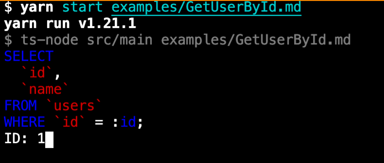
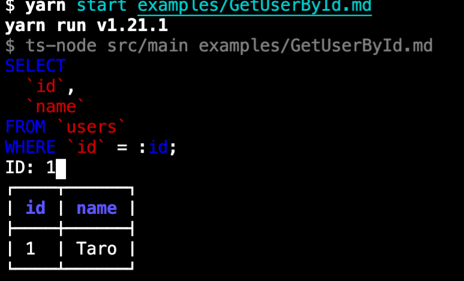
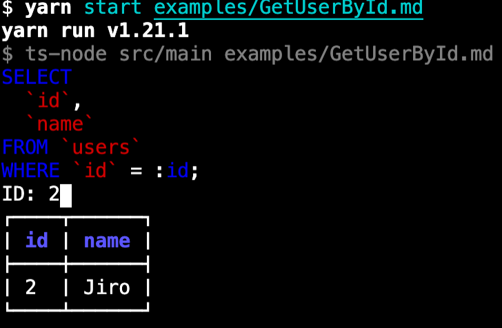

# sql-collection-prototype

Supports query execution by writing SQL templates in markdown.

## Input Data

See [GetUserById.md](examples/GetUserById.md).

- Use the sql code block whose meta key is specified as `template` as a SQL template.
- The format of input data can be specified by describing in the JSON Schema notation in the yaml code block whose meta key is specified as `input-schema`.

## Example

1. Run script by `yarn cli cui examples/GetUserById.md`.
  
2. Press Enter.
3. The result is output.
  
4. If you set the id to 2 and press Enter, The result changes immediately.
  

## License

This software is released under the MIT License, see [LICENSE](./LICENSE).
